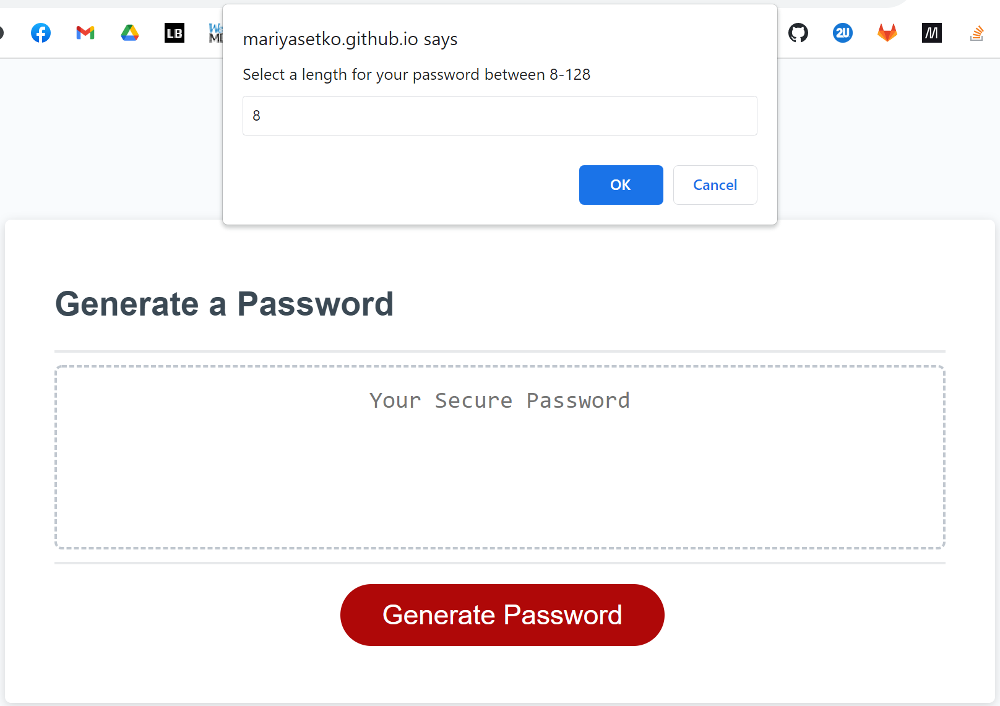

# JavaScript: Password Generator

## Description/Purpose

An employee with access to sensitive data needs a randomly generated passwords following specified criteria in order to create a strong password for greater security.

The set criteria are the below:
- Password length between 8-128 characters
- Option to include uppercase letters
- Option to include lowercase letters
- Option to include numbers
- Option to include [special characters](https://www.owasp.org/index.php/Password_special_characters)

## Method

To meet the Acceptance Criteria, I created code that:
- Validates the entry is a number and falls within the 8-128 range
- Validates that at least one of the criteria was selected
- Randomly generates the selected criteria
- Loops until there are enough randomly selected characters to fulfill the user selected password length
- Displays the finalized password in the space provided
- Accomplishes all of the above through having the user select a series of prompts

## Mockups

This is the first thing the user sees when the button is clicked:

This is the message when an incorrect value (either letters or a number outside of 8-128) is provided:

This is the password generated when all options are selected:

